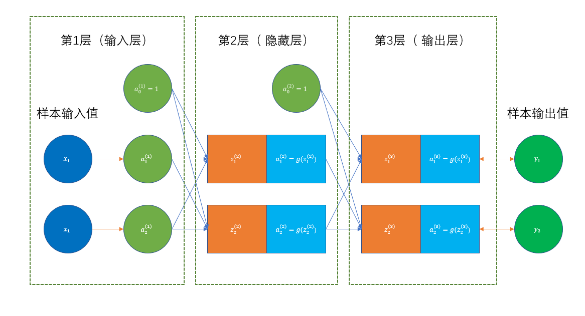

# 神经网络模型的计算

## 一、例子

设提供的训练样本输入值为$(x_1=0.05, x_2=0.1)$，输出值为$(y_1=1, y_2=0)$。

第一层到第二层的各节点权重系数$\Theta^{(1)}$如下：
$$
\begin{align*}
\theta^{(1)}_{1,0}&=-0.37,&\theta^{(1)}_{1,1}&=0.14,&\theta^{(1)}_{1,2}&=-0.06\\
\theta^{(1)}_{2,0}&=0.15,&\theta^{(1)}_{2,1}&=0.2,&\theta^{(1)}_{2,2}&=0.4\\
\end{align*}
$$
第二层到第三层的各节点权重系数$\Theta^{(2)}$如下：
$$
\begin{align*}
\theta^{(2)}_{1,0}&=0.07,&\theta^{(2)}_{1,1}&=0.29,&\theta^{(2)}_{1,2}&=0.33\\
\theta^{(2)}_{2,0}&=0.1,&\theta^{(2)}_{2,1}&=-0.27,&\theta^{(2)}_{2,2}&=0.5\\
\end{align*}
$$
一开始上述的权重系数都是随机选择的，选取策略为：
$$
\Theta=rand(0,1)*2\epsilon-\epsilon
$$
这样权重系数会落在$(-\epsilon,\epsilon)$之间。

我们的目标是，通过选择恰当的权重系数，使得输入值$(x_1, x_2)$经过神经网络的计算，输出一个接近样本输出值$(y_1,y_2)$的结果值。

## 二、前向传播计算各层的值

### 2.1 输入层到隐藏层

$$
\begin{align}
z^{(2)}_1&=\theta^{(1)}_{1,0}*a^{(1)}_{1,0}+\theta^{(1)}_{1,1}*a^{(1)}_{1,1}+\theta^{(1)}_{1,2}*a^{(1)}_{1,2}\\
&=-0.37\times1+0.14\times0.05+(-0.06)\times0.1\\
&=-0.369
\end{align}
$$

