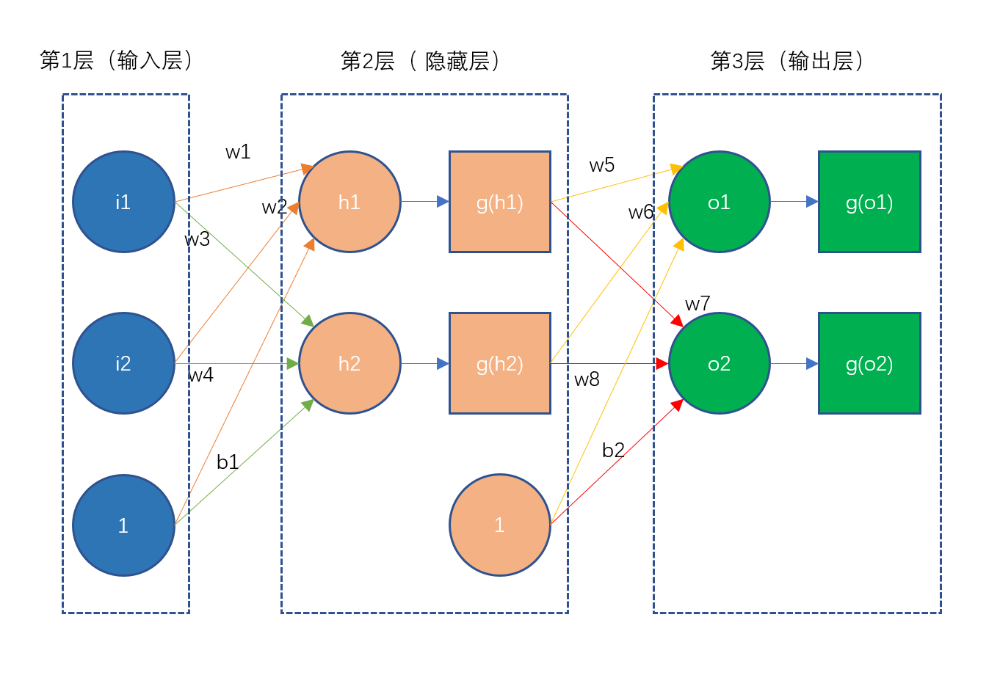
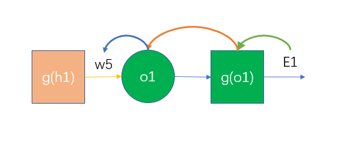
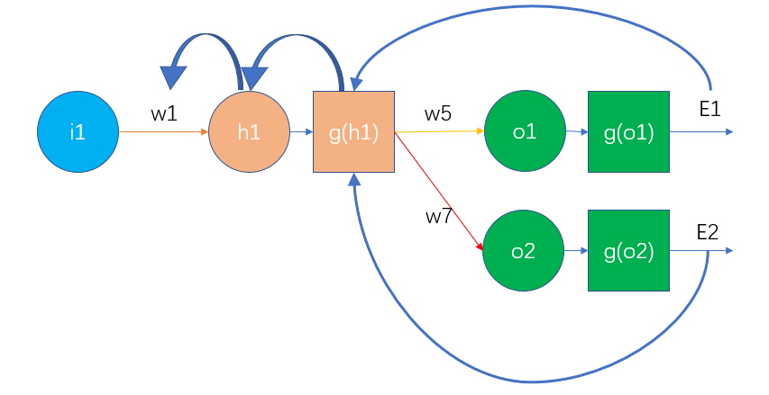

# 神经网络的计算

## 一、样例

以上图为例，该图为一个三层的神经网络，两个输入，两个输出，上图的初始值如下：

第1层输入层：$i_1 = 0.05，i_2 = 0.1$

第1层到第2层的权重系数为：$w_1=0.15，w_2=0.2，w_3=0.25，w_4=0.3$，bias单元的权重$b_1=0.35$。

第2层到第3层（输出层）的权重系数为：$w_5=0.4，w_6=0.45，w_7=0.5，w_8=0.55$，bias单元的权重$b_2=0.6$。

样本输出值为：$t_1=0.01，t_2=0.99$

我们的目标是，通过选择恰当的权重系数，使得输入值$(i_1, i_2)$经过神经网络的计算，输出一个接近样本输出值$(t_1,t_2)$的结果值。

一开始我们的权重系数$w_1\cdots w_8$是任意选择的，我们可以通过前向传播来计算输出结果值，再通过反向传播来优化权重系数$w_1\cdots w_8$。

## 二、前向传播计算过程

### 2.1、输入层到隐藏层

$$
\begin{align}
h_1&=i_1\times w_1+i_2\times w_2 + 1\times b_1\\
&=0.05\times0.15+0.1\times0.2+1\times0.35\\
&=0.3775
\end{align}
$$

$$
\begin{align}
h_2&=i_1\times w_3+i_2\times w_4+1\times b_1\\
&=0.05\times0.25+0.1\times0.3+1\times0.35\\
&=0.3925
\end{align}
$$

此处激活函数$g$为$Sigmoid$函数，即$g(x)=\frac{1}{1+e^{-x}}$。
$$
g(h_1)=\frac{1}{1+e^{-0.3775}}=0.59327\\
g(h_2)=\frac{1}{1+e^{-0.3925}}=0.596884
$$

### 2.2、隐藏层到输出层

$$
\begin{align}
o_1&=g(h_1)\times w_5+g(h_2)\times w_6 + 1\times b_2\\
&=0.59327\times0.4+0.596884\times0.45+1\times0.6\\
&=1.105906
\end{align}
$$

$$
\begin{align}
o_2&=g(h_1)\times w_7+g(h_2)\times w_8 +1\times b_2\\
&=0.59327\times0.5+0.596884\times0.55+1\times0.6\\
&=1.224921
\end{align}
$$

$$
g(o_1)=\frac{1}{1+e^{-1.105906}}=0.751365\\
g(o_2)=\frac{1}{1+e^{-1.224921}}=0.772928
$$

此时，前向传播的过程就完成了，我们得到输出值为$[0.751365, 0.772928]$，该值和样本值$[0.01, 0.99]$相差甚远，所以我们要对误差进行反向传播，来更新权重系数，以便输出结果更接近样本输出值。

## 三、反向传播的计算过程

### 3.1 总误差

$$
E_{total}=\frac{1}{2}\sum_{i=1}^m(h(x_i)-y_i)^2
$$

即总误差为每个输出值与样本值的差的平方和再除以2。

于是我们上述的总误差为：
$$
\begin{align}
E_{total}&=E_{g(o_1)}+E_{g(o_2)}\\&=\frac{1}{2}\times(0.751365-0.01)^2+\frac{1}{2}\times(0.772928-0.99)^2\\
&=\frac{1}{2}\times(0.741365)^2+\frac{1}{2}\times(-0.21707)^2\\
&=\frac{1}{2}\times0.549622166+\frac{1}{2}\times0.04712\\
&=0.274811083+0.02356\\
&=0.298371
\end{align}
$$

### 3.2 隐藏层到输出层的权重更新

以$w_5$为例，我们要计算它对总误差的影响，可以用总误差对$w_5$求偏导数的方法求出。而计算$\frac{\partial E_{total}}{\partial w_5}$，我们可以使用链式法则来求导。
$$
\frac{\partial E_{total}}{\partial w_5}=\frac{\partial E_{total}}{\partial g(o_1)}*\frac{\partial g(o_1)}{\partial o_1}*\frac{\partial o_1}{\partial w_5}
$$
#### 3.2.1 计算$\frac{\partial E_{total}}{\partial g(o_1)}$

$$
\begin{align}
\frac{\partial E_{total}}{\partial g(o_1)}&=(\frac{1}{2}(g(o_1)-t_1)^2+\frac{1}{2}(g(o_2)-t_2)^2)'\\
&=\frac{1}{2}\times2\times (g(o_1)-t_1)^{2-1}+0\\
&=g(o_1)-t_1\\
\end{align}
$$
其中$g(o_1)=0.751365$，$t_1=0.01$，代入上面公式得到：
$$
\begin{align}
\frac{\partial E_{total}}{\partial g(o_1)}&=g(o_1)-t_1\\
&=0.751365-0.01\\
&=0.741365
\end{align}
$$
#### 3.2.2 计算$\frac{\partial g(o_1)}{\partial o_1}$

$$
\begin{align}
\frac{\partial g(o_1)}{\partial o_1}&=(\frac{1}{1+e^{-x}})'\\
&=\frac{1'\times(1+e^{-x})-1\times(1+e^{-x})'}{(1+e^{-x})^2}\\
&=-\frac{(1+e^{-x})'}{(1+e^{-x})^2}\\
&=-\frac{1'+(e^{-x})'}{(1+e^{-x})^2}\\
&=-\frac{(e^{-x})'}{(1+e^{-x})^2}\\
&=-\frac{-e^{-x}}{(1+e^{-x})^2}\\
&=\frac{e^{-x}}{(1+e^{-x})^2}\\
&=\frac{1}{1+e^{-x}}\times\frac{e^{-x}}{1+e^{-x}}\\
&=\frac{1}{1+e^{-x}}\times\frac{1+e^{-x}-1}{1+e^{-x}}\\
&=\frac{1}{1+e^{-x}}\times(1-\frac{1}{1+e^{-x}})\\
&=g(x)(1-g(x))
\end{align}
$$
其中$g(x)=g(o_1)=0.751365$，代入上式得到：
$$
\begin{align}
\frac{\partial g(o_1)}{\partial o_1}&=g(x)(1-g(x))\\
&=0.751365\times(1-0.751365)\\
&=0.186816\end{align}
$$
#### 3.2.3 计算$\frac{\partial o_1}{\partial w_5}$

$$
\begin{align}
\frac{\partial o_1}{\partial w_5}&=(g(h_1)\times w_5+g(h_2)\times w_6 + 1\times b_2)'\\
&=g(h_1)+0+0\\
&=g(h_1)
\end{align}
$$
其中$g(h_1)=0.59327$，代入上式得到：
$$
\frac{\partial o_1}{\partial w_5}=g(h_1)=0.59327
$$
#### 3.2.4 组合计算

$$
\begin{align}
\frac{\partial E_{total}}{\partial w_5}&=\frac{\partial E_{total}}{\partial g(o_1)}*\frac{\partial g(o_1)}{\partial o_1}*\frac{\partial o_1}{\partial w_5}\\
&=0.741365\times0.186816\times0.59327\\
&=0.082167
\end{align}
$$
因此，$w_5$对总误差的影响系数为0.082167。

#### 3.2.5 输出层误差

根据上面的链式求导过程，我们可以把求$\frac{\partial E_{total}}{\partial w_5}$简化为：
$$
\frac{\partial E_{total}}{\partial w_5}=(g(o_1)-t_1)*g(o_1)(1-g(o_1))*g(h_1)
$$
此时我们引入$\delta_{o1}=\frac{\partial E_{total}}{\partial o_1}$来表示输出层的误差（未经过激活函数），即：
$$
\delta_{o_1}=\frac{\partial E_{total}}{\partial_{o_1}}=\frac{\partial E_{total}}{\partial g(o_1)}*\frac{\partial g(o_1)}{\partial o_1}\\
=(g(o_1)-t_1)*g(o_1)(1-g(o_1))
$$
而总误差对$w_5$的偏导公式可以写成：$\frac{\partial E_{total}}{\partial w_5}=\delta_{o_1}*g(h_1)$。如果输出层误差为负数，上述公式也可以写成$\frac{\partial E_{total}}{\partial w_5}=-\delta_{o_1}*g(h_1)$。

#### 3.2.6 更新$w_5$

接着我们来更新$w_5$的值，更新公式为：
$$
w_5^+=w_5-\alpha\frac{\partial E_{total}}{\partial w_5}
$$
其中，$\alpha$为学习速率，这里我们可以取值0.5，于是得到：
$$
w_5^+=0.4-0.5\times0.082167=0.358916
$$
基于同样的原理，我们可以分别计算出：
$$
w_6^+=0.408666\\
w_7^+=0.511301\\
w_8^+=0.561370
$$

### 3.3 输入层到隐藏层的权重更新

接下来我们来计算$w_1$对总误差的影响，并以此来推广至$w_2、w_3、w_4$，根据链式法则，计算$\frac{\partial E_{total}}{\partial w_1}$可分解为：
$$
\frac{\partial E_{total}}{\partial w_1}=\frac{\partial E_{total}}{\partial g(h_1)}*\frac{\partial g(h_1)}{\partial h_1}*\frac{\partial h_1}{\partial w_1}
$$
由于$g(h_1)$会接收来自$E_{g(o_2)}$和$E_{g(o_2)}$的误差，因此$\frac{\partial E_{total}}{\partial g(h_1)}=\frac{\partial E_{g(o_1)}}{\partial g(h_1)}+\frac{\partial E_{g(o_2)}}{\partial g(h_1)}$。

#### 3.3.1 计算$\frac{\partial E_{g(o_1)}}{\partial g(h_1)}$

$$
\begin{align}
\frac{\partial E_{g(o_1)}}{\partial g(h_1)}&=\frac{\partial E_{g(o_1)}}{\partial g(o_1)}*\frac{\partial g(o_1)}{\partial o_1}*\frac{\partial o_1}{\partial g(h_1)}\\
&=0.741365\times0.186816\times0.4\\
&=0.055399537536
\end{align}
$$

#### 3.3.2 计算$\frac{\partial E_{g(o_2)}}{\partial g(h_1)}$

$$
\begin{align}
\frac{\partial E_{g(o_2)}}{\partial g(h_1)}&=\frac{\partial E_{g(o_2)}}{\partial g(o_2)}*\frac{\partial g(o_2)}{\partial o_2}*\frac{\partial o_2}{\partial g(h_1)}\\
&=(g(o_2)-t_2)\times g(o_2)(1-g(o_2))\times w_7\\
&=-0.21707\times0.772928\times(1-0.772928)\times0.5\\
&=-0.01904901115027456
\end{align}
$$

#### 3.3.3 计算$\frac{\partial E_{total}}{\partial g(h_1)}$

$$
\begin{align}
\frac{\partial E_{total}}{\partial g(h_1)}&=\frac{\partial E_{g(o_1)}}{\partial g(h_1)}+\frac{\partial E_{g(o_2)}}{\partial g(h_1)}\\&=0.055399537536+(-0.01904901115027456)\\&=0.03635052638572544\end{align}
$$

#### 3.3.4 计算$\frac{\partial g(h_1)}{\partial h_1}$

$$
\frac{\partial g(h_1)}{\partial h_1}=g(h1)\times(1-g(h1))=0.59327\times(1-0.59327)=0.2413007071
$$

#### 3.3.5 计算$\frac{\partial h_1}{\partial w_1}$

$$
\frac{\partial h_1}{\partial w_1}=(i_1\times w_1+i_2\times w_2 + 1\times b_1)'=i_1=0.05
$$

#### 3.3.6 组合计算

$$
\begin{align*}\frac{\partial E_{total}}{\partial w_1}&=\frac{\partial E_{total}}{\partial g(h_1)}*\frac{\partial g(h_1)}{\partial h_1}*\frac{\partial h_1}{\partial w_1}\\
&=(\frac{\partial E_{g(o_1)}}{\partial g(o_1)}*\frac{\partial g(o_1)}{\partial o_1}*\frac{\partial o_1}{\partial g(h_1)}+\frac{\partial E_{g(o_2)}}{\partial g(o_2)}*\frac{\partial g(o_2)}{\partial o_2}*\frac{\partial o_2}{\partial g(h_1)})*\frac{\partial g(h_1)}{\partial h_1}*\frac{\partial h_1}{\partial w_1}\\
&=((g(o_1)-t_1)\times g(o_1)(1-g(o_1))\times w_5+(g(o_2)-t_2)\\
&\times g(o_2)(1-g(o_2))\times w_7)*g(h1)\times(1-g(h1))*i_1\\
&=0.03635052638572544\times0.2413007071\times0.05\\
&=0.000438570386\end{align*}
$$

因此，$w_1$对总误差的影响系数为0.000438570386。

#### 3.3.7 隐藏层误差

上面的式子可以简化为：
$$
\begin{align*}\frac{\partial E_{total}}{\partial w_1}&=\frac{\partial E_{total}}{\partial g(h_1)}*\frac{\partial g(h_1)}{\partial h_1}*\frac{\partial h_1}{\partial w_1}\\
&=(\frac{\partial E_{g(o_1)}}{\partial g(o_1)}*\frac{\partial g(o_1)}{\partial o_1}*\frac{\partial o_1}{\partial g(h_1)}+\frac{\partial E_{g(o_2)}}{\partial g(o_2)}*\frac{\partial g(o_2)}{\partial o_2}*\frac{\partial o_2}{\partial g(h_1)})*\frac{\partial g(h_1)}{\partial h_1}*\frac{\partial h_1}{\partial w_1}\\
&=((g(o_1)-t_1)\times g(o_1)(1-g(o_1))\times w_5+(g(o_2)-t_2)\times g(o_2)(1-g(o_2))\times w_7)*g(h1)\times(1-g(h1))*i_1\\
&=(\delta_{o_1}\times w_5 + \delta_{o_2}\times w_7)\times g(h1)\times(1-g(h1))\times i_1\\
&=\sum\delta_ow_{g(h_1)}\times g(h1)\times(1-g(h1))\times i_1\\
&=\delta_{h_1}i_1
\end{align*}
$$

#### 3.3.8 更新$w_1$

$$
w_1^+=w_1-\alpha\frac{\partial E_{total}}{\partial w_1}
$$

其中，$\alpha$为学习速率，这里我们可以取值0.5，于是得到：
$$
w_1^+=0.15-0.5\times0.000438570386=0.149780714807
$$
基于同样的原理，我们可以分别计算出：
$$
w_2^+=0.19956143\\
w_3^+=0.24975114\\
w_4^+=0.29950229
$$

## 四、更新输出值

经过一轮后向传播，我们得到了新的权重系数，分别是：
$$
w_1^+=0.149781\\
w_2^+=0.199561\\
w_3^+=0.249751\\
w_4^+=0.299502\\
w_5^+=0.358916\\
w_6^+=0.408666\\
w_7^+=0.511301\\
w_8^+=0.561370
$$
利用更新后的权重系数，再进行一次前向传播，可以得到输出值为：[0.742088，0.775285]，总误差为：0.291028，较之前的0.298371下降了0.007343，这是一轮更新后得到的优化结果。当经过10000次迭代后，输出值为：[0.015912196, 0.984065734]，这样就很接近样本值[0.01, 0.99]了，此时的总误差为：0.0000351085。