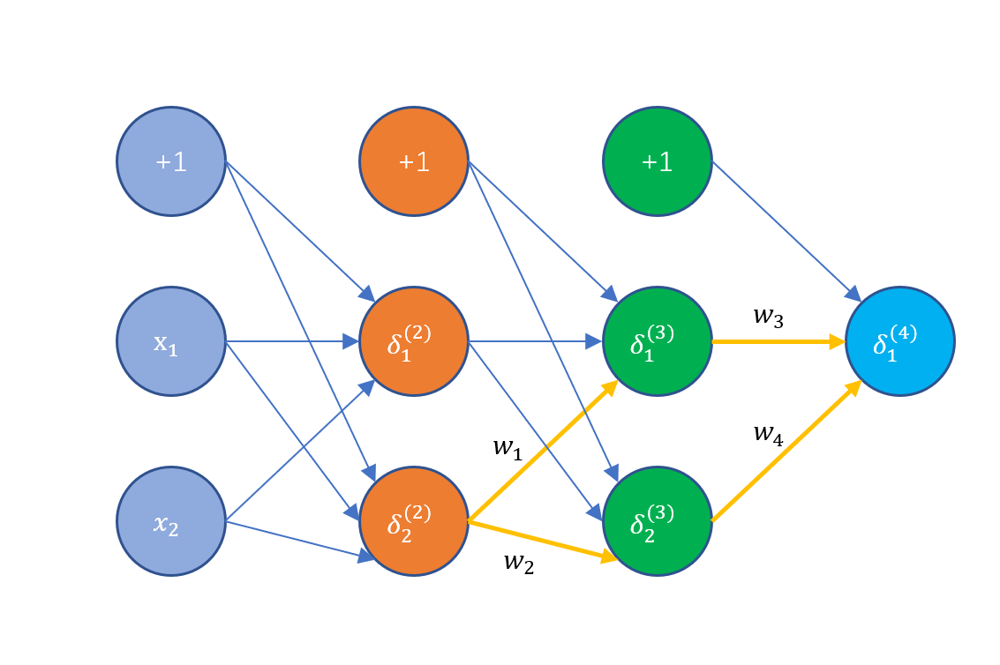

# 第5周 代价函数和反向传播

## 一、代价函数

首先定义几个变量：

+ L：神经网络的层数（包含了输入和输出层）

+ $s_l$：第$l$层的激活节点数，不包含偏差节点

+ K：输出的分类数

+ $h_\Theta(x)_k$：假设函数在第k个输出节点的结果

+ $\theta^k_{ij}$：第$k$层的第$j$个输入到第$k+1$层的第$i$个激活节点

  ***k***：代表第***k***到***k+1***层的映射。

  ***i***：代表第***k+1***层的第***i***个激活节点。（不包含偏差节点）

  ***j***：代表第***k***层的第***j***个输入。（包含偏差节点）
  
  $\Theta^{层数}_{目标节点，输入节点}$

之前逻辑回归的代价函数为：
$$
J(\theta)=-\frac{1}{m}\sum_{i=1}^m\left[y^{(i)}log(h_\theta(x^{(i)}))+(1-y^{(i)})log(1-h_\theta(x^{(i)}))\right]+\frac{\lambda}{2m}\sum_{j=1}^{n}\theta^2_j
$$
而神经网络的代价函数是逻辑回归函数的泛化，如下，其中$h_\Theta(x)_i$表示第i个输出：
$$
J(\Theta) = - \frac{1}{m} \sum_{i=1}^m \sum_{k=1}^K \left[y^{(i)}_k \log ((h_\Theta (x^{(i)}))_k) + (1 - y^{(i)}_k)\log (1 - (h_\Theta(x^{(i)}))_k)\right]\\ + \frac{\lambda}{2m}\sum_{l=1}^{L-1} \sum_{i=1}^{s_l} \sum_{j=1}^{s_{l+1}} ( \Theta_{j,i}^{(l)})^2
$$
这里添加一些嵌套求和，以说明我们的多个输出节点。在公式的第一部分中，在方括号之前，有一个附加的嵌套求和，该求和遍历输出节点的数量。

在正则化部分中，即方括号之后，我们必须考虑多个$\theta$矩阵。当前$\theta$矩阵中的列数等于当前层（包含偏差单元）中的节点数。当前$\theta$矩阵中的行数等于下一层的节点数（不包含偏差单元）。与之前的逻辑回归一样，我们对每个项目都求平方。

注意：

+ 嵌套求和只是为了将输出层中的每个单元的逻辑回归成本相加。

+ 三重嵌套求和只是为了将整个神经网络中所有单独$\theta$的平方相加。并不是真正的三次和相加。

  

## 二、反向传播算法

反向传播是最小化神经网络代价函数的一个算法，正如我们在逻辑回归和线性回归代价函数中所做的那样，我们的目的是最小化$J(\Theta)$的值。也就是说，我们想用最优的$\Theta$参数集来最小化代价函数$J$。于是，问题就转换为如何求解$J(\Theta)$的偏导数$\frac{\partial}{\partial\Theta^{(l)}_{ij}}J(\Theta)$。

给定训练集${(x^{(1)},y^{(1)}),(x^{(2)},y^{(2)}),(x^{(3)},y^{(3)}),\cdots,(x^{(m)},y^{(m)})}$，设对每一个$(l,i,j)$，有$\Delta^{(l)}_{i,j}=0$，接下来根据训练集进行计算：

1. 设$a^{(1)}:=x^{(t)}$，$t=1\cdots m$

2. 前向传播计算$a^{(l)}$的值，$l=2,3,\cdots,L$。L为神经网络的层数（含输入层和输出层）。$a^{(l)}$为第l层的激活节点（经过sigmoid函数计算）。对于四层的神经网络，有：
   $$
   \begin{align*}
   a^{(1)}&=x\\
   z^{(2)}&=\Theta^{(1)}a^{(1)}\\
   a^{(2)}&=g(z^{(2)}+a^{(2)}_0)\\
   z^{(3)}&=\Theta^{(2)}a^{(2)}\\
   a^{(3)}&=g(z^{(3)}+a^{(3)}_0)\\
   z^{(4)}&=\Theta^{(3)}a^{(3)}\\
   \end{align*}
   $$

3. 计算输出层的误差：$\delta^{(L)}=a^{(L)}-y^{(t)}$。

4. 计算第2到L-1层的误差：$\delta^{(l)}=(\Theta^{(l)})^T\delta^{(l+1)}\cdot a^{(l)}\cdot(1-a^{(l)})$

5. 更新$\Delta^{(l)}_{i,j}$，$\Delta^{(l)}_{i,j}:=\Delta^{(l)}_{i,j}+a_j^{(l)}\delta_i^{(l+1)}$。

最终$J(\Theta)$的偏导数$\frac{\partial}{\partial\Theta^{(l)}_{ij}}J(\Theta)$可写为：
$$
\begin{align}
\frac{\partial}{\partial\Theta^{(l)}_{ij}}J(\Theta)=D^{(l)}_{i,j}&=\frac{1}{m}(\Delta^{(l)}_{i,j}+\lambda\Theta^{(l)}_{i,j}),if\space j\neq0\\
\frac{\partial}{\partial\Theta^{(l)}_{ij}}J(\Theta)=D^{(l)}_{i,j}&=\frac{1}{m}\Delta^{(l)}_{i,j},if\space j=0
\end{align}
$$

第4步的$\delta^{(l)}$是第$l$层的误差，即目标值对该层的激活节点值求偏导数，推导过程如下：

首先需定义一个总误差的概念：$E_{total}=\frac{1}{2}\sum_{i=1}^m(h(x_i)-y_i)^2$

第L层（输出层）的误差：$\delta^{(L)}=a^{(L)}-y^{(t)}$。

第L-1层的某一个激活节点的误差为：
$$
\begin{align*}
\delta^{(L-1)}&=\frac{\partial E}{\partial a^{(L-1)}}\\
&=\frac{\partial E}{\partial a^{(L)}}\times\frac{\partial a^{(L)}}{\partial z^{(L)}}\times\frac{\partial z^{(L)}}{\partial a^{(L-1)}}\\
&=(\frac{1}{2}(a^{(L)}-y^{t})^2)'\times(\frac{1}{1+e^{-z^{(L)}}})'\times((\Theta^{(L-1)})^Ta^{(L-1)})'\\
&=(a^{(L)}-y^{(t)})\times(a^{(L)})(1-a^{(L)})\times(\Theta^{(L-1)})^T\\
&=\delta^{(L)}\times(a^{(L)})(1-a^{(L)})\times(\Theta^{(L-1)})^T

\end{align*}
$$

## 三、进一步理解反向传播

神经网络的代价函数形如：
$$
J(\Theta) = - \frac{1}{m} \sum_{i=1}^m \sum_{k=1}^K \left[y^{(i)}_k \log ((h_\Theta (x^{(i)}))_k) + (1 - y^{(i)}_k)\log (1 - (h_\Theta(x^{(i)}))_k)\right]\\ + \frac{\lambda}{2m}\sum_{l=1}^{L-1} \sum_{i=1}^{s_l} \sum_{j=1}^{s_{l+1}} ( \Theta_{j,i}^{(l)})^2
$$

如果我们只考虑二分类情况，并忽略正则化，那么代价函数可以简化成：
$$
cost(t)=y^{(t)}log(h_\Theta(x^{(t)}))+(1-y^{(t)})log(1-h_\Theta(x^{(t)}))
$$
$\delta^{(l)}_j$是第$l$层的$j$个激活单元$a^{(l)}_j$的误差，其值等于代价函数值求激活单元值的偏导数，即：
$$
\delta^{(l)}_j=\frac{\partial}{\partial a_j^{(l)}}cost(t)
$$
导数是代价函数相切的直线的斜率，因此斜率越陡，误差越大。因此我们的目的就是减少这个斜率（误差值）。

如上图，$\delta^{(4)}_1$的值等于实际值与输出值的差，

$$
\begin{align*}
\delta_1^{(3)}&=\delta_1^{(4)}w_3\\
\delta_2^{(3)}&=\delta_1^{(4)}w_4\\
\delta_2^{(2)}&=\delta_1^{(3)}w_1+\delta_2^{(3)}w_25
\end{align*}
$$

## 四、梯度检查

梯度检查可以确保反向传播算法得到的结果是正确的。我们可以求代价函数的近似导数：
$$
\frac{\partial}{\partial\Theta}J(\Theta)\approx\frac{J(\Theta+\epsilon)+J(\Theta-\epsilon)}{2\epsilon}
$$

对于多个$\Theta$矩阵，我们可以这样近似求导：
$$
\frac{\partial}{\partial\Theta_j}J(\Theta)\approx\frac{J(\Theta_1,\cdots,\Theta+\epsilon,\cdots,\Theta_n)+J(\Theta_1,\cdots,\Theta-\epsilon,\cdots,\Theta_n)}{2\epsilon}
$$
一个小的$\epsilon=10^{-4}$可以保证上述公式得到正确的结果，如果$\epsilon$太小的话，可能会产生计算精度问题。

之前我们已经讨论过如何计算$J(\Theta)$的偏导数$\frac{\partial}{\partial\Theta^{(l)}_{ij}}J(\Theta)$，因此只要梯度检查算出来的结果与$J(\Theta)$的偏导数$\frac{\partial}{\partial\Theta^{(l)}_{ij}}J(\Theta)$近似相等，就可以认为我们的后向传播算法是正确的。一定完成梯度检查，就应该在计算中关闭该检查，否则对性能有很大的影响。

## 五、随机初始化$\Theta$权重值

神经网络的权重值不能全部初始化为0。因为这样的话，当我们在做反向传播的时候，所有节点都会更新为相同的值，也就无法得到恰当的$\Theta$值。

反之，我们可以采取随机方法来初始化这些权重值：
$$
\Theta=rand(0,1)*2\epsilon-\epsilon
$$
这样$\Theta$就落在$(-\epsilon,\epsilon)$之间。

## 六、知识点集合

### 6.1 选择神经网络结构

1. 根据输入的$x^{(i)}$确定输入单元数。
2. 根据输出的$y^{(i)}$确定输出单元数。
3. 确定每个隐藏层的激活单元数量，通常来说越多越好，但需要平衡计算代价。
4. 确定隐藏层的数量，一般来说1个隐藏层就够了，如果多于一个隐藏层，那么每个隐藏层的激活单元应该数量一样。

### 6.2 训练神经网络

1. 随机选择初始化权重值。
2. 前向传播计算出结果值。
3. 计算代价函数。
4. 反向传播计算偏导数。
5. 使用梯度检查算法确认反向传播计算无误。
6. 使用梯度下降或其他方式最小化代价函数和权重值。

理想情况下，我们想得到$h_\Theta(x^{(i)})\approx y^{(i)}$。这样会最小化代价函数。但是$J(\Theta)$不是一个凸函数，因此我们可能只能获得局部最优解而不是全局最优解。

