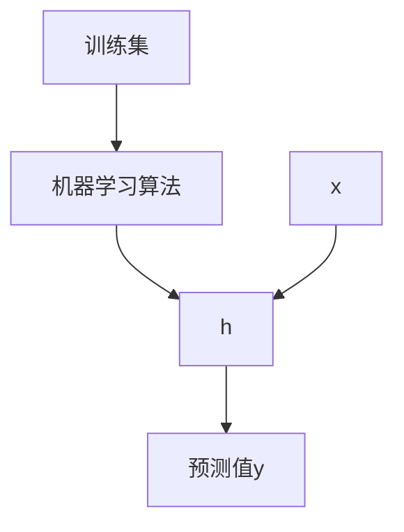

# 第1周 机器学习定义、代价函数、梯度下降、矩阵和向量

## 一、机器学习

+ 在AI工作中发展

+ 计算机的新功能

  例子：数据挖掘、自动控制、手写识别、自然语言处理、计算机视觉等

## 二、机器学习的定义

Two definitions of Machine Learning are offered. Arthur Samuel described it as: "the field of study that gives computers the ability to learn without being explicitly programmed." This is an older, informal definition.

Tom Mitchell provides a more modern definition: "A computer program is said to learn from experience E with respect to some class of tasks T and performance measure P, if its performance at tasks in T, as measured by P, improves with experience E."

## 三、机器学习算法

+ 监督学习：回归、分类
+ 无监督学习：聚类

## 四、监督学习模型表示

根据训练集和学习算法对输入的测试集进行预测。

## 五、代价函数

$$
J(\theta_0,\theta_1)=\frac{1}{2m}\sum_{i=1}^m(\hat{y}−y_i)^2 = \frac{1}{2m}\sum_{i=1}^m(h_\theta (x_i)−y_i)^2
$$

该函数也称为平方差函数，除以2是为了在计算梯度下降时抵消导数项。

为了使得预测函数越精准，就越需要==**最小化代价函数的值**==$\underbrace{minimize}_{\theta_0\theta_1}J(\theta_0, \theta_1)$。最理想情况下，就是预测值刚好等于实际值，此时函数的结果为0。

## 六、梯度下降

作用：用来估算预测函数中的参数值。

在开始时，随意的选择参数值，一般选择初始值为0，然后逐步同步改变参数值，reduce计算，即可以得到局部最优解。这里涉及一个经验问题，即如何“随机”选择初始参数值。

梯度下降算法如下：
$$
\theta_j := \theta_j - \alpha\frac{\partial}{\partial\theta_j}J(\theta_0, \theta_1)
$$
其中α是学习速率，其后是代价函数的导数。初始值j=0和1，重复这一公式进行计算，直到结果收敛。在计算θ时，要同步更新2个参数值，再代入公式。

我们应该调整参数α以确保梯度下降算法在合理的时间内收敛，如果无法收敛或没有太多时间获得最小值，则意味着我们选择的学习速率α是错误的。

α太小意味着学习时间太长。

α太大意味着可能错过收敛点导致无法得到结果。

当到达最低点时，导数结果为0，$\theta$值不会变。此时达到（局部）最优解。

## 七、矩阵和向量

### 7.1 矩阵

矩阵是二维数组。
$$
R = \left[\begin{matrix} a & b & c & d & e\\ f & g & h & i & j \\ k & l & m & n & o \\ p & q & r & s & t \end{matrix} \right]
$$
R4$\times$5表示该矩阵有4行5列。其中Rij表示第i行第j列的元素。

### 7.2 向量

向量是一维数组。
$$
\vec{y} = \left[\begin{matrix}a\\b\\c\\d\end{matrix}\right]
$$
yi代表第i个元素。

在本课程中，默认下标从1开始。

### 7.3 矩阵加减法

两个矩阵相加减，必须行列数一致，结果为各个对应位置上的值进行相加减的结果。
$$
\left[\begin{matrix}a, & b\\c, & d\end{matrix}\right] + \left[\begin{matrix}e, & f\\g, & h\end{matrix}\right] =\left[\begin{matrix}a+e, & b+f\\c+g,&d+h\end{matrix}\right]
$$

### 7.4 矩阵与标量的乘除法

相当于矩阵的每个元素分别与标量进行乘除运算。
$$
\left[\begin{matrix}a, & b\\c, & d\end{matrix}\right] *e = \left[\begin{matrix}a*e, & b*e\\c*e, & d*e\end{matrix}\right]
$$

$$
e * \left[\begin{matrix}a, & b\\c, & d\end{matrix}\right] = \left[\begin{matrix}e*a, & e*b\\e*c, & e*d\end{matrix}\right]
$$

### 7.5 矩阵与向量相乘

矩阵的列数必须与向量的维数相同，结果是一个矩阵行数的向量。
$$
\left[\begin{matrix}a, & b\\c, & d\\e, & f\end{matrix}\right] * \left[\begin{matrix}g\\h\end{matrix}\right]=\left[\begin{matrix}a*g+b*h\\c*g+d*h\\e*g+f*h\end{matrix}\right]
$$
即：Ri$\times$j  $\times$ $\vec{y}$j = $\vec{y}$i

### 7.6 矩阵与矩阵相乘除

被乘（除）数矩阵的列数必须与乘（除）数矩阵的行数相同，得到一个新的矩阵，结果矩阵的行数为被乘（除）数的行数，结果矩阵的列数等于乘（除）数矩阵的列数。

即Ai$\times$j $\times$ Bj$\times$k = Ci$\times$k
$$
\left[\begin{matrix}a, & b\\c, & d\\e, & f\end{matrix}\right] * \left[\begin{matrix}g, &h\\i,& j\end{matrix}\right]=\left[\begin{matrix}ag+bi,&ah+bj\\cg+di,&ch+dj\\eg+fi,&eh+fj\end{matrix}\right]
$$

### 7.7 矩阵的性质

不满足交换律，但满足结合律。
$$
A \times B ≠ B \times A
$$

$$
(A \times B) \times C = A \times (B \times C)
$$

### 7.8 单位矩阵

单位矩阵为对角线全1的矩阵。

### 7.9 逆矩阵

矩阵的逆矩阵表示为A-1,它和A相乘的结果是单位矩阵。

### 7.10 转置矩阵

矩阵的转置相当于旋转90°，Aij = Aji 

运算律：
$$
(A^T)^T=A
$$

$$
(\lambda A)^T=\lambda A^T
$$

$$
(AB)^T=B^TA^T
$$

